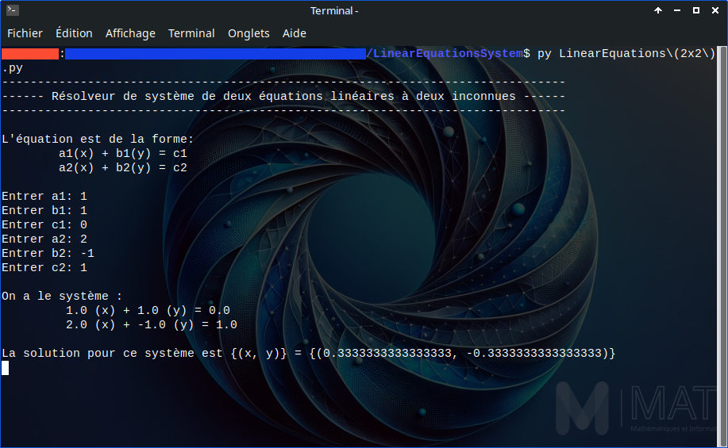
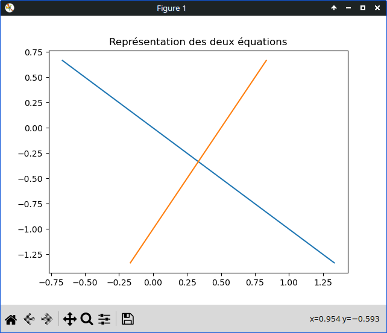

# Equations linéaires (2x2)

_Un programme en écrit python qui résoud un système de deux équations linéaires à deux inconnues._

## Objectif du projet

Donne une solution au système de deux équations linéaires à deux inconnues si le système est résolvable.

## Prérequi

Pour la visualisation du graphe des deux équations, vous aurez besoin de `matplotlib`:

```bash
pip install matplotlib
```

## Etapes de résolution

Considérons le système $(S)$ suivant dont $x$ et $y$ sont inconnues réels, $a_i$, $b_i$ et $c_i$ $\in \mathbb{R}$ pour $i \in \{1, 2\}$:

$$
    (S) 
    \left\{
        \begin{array}{r}
            a_1(x) + b_1(y) = c_1 \\
            a_2(x) + b_2(y) = c_2
        \end{array} 
    \right. 
$$

D'abord, on vérifie que la matrice A définie par 
$
    A = 
    \left(
        \begin{array}{cc}
            a_1 & b_1 \\
            a_2 & b_2
        \end{array} 
    \right)
$
 est inversible, c'est à dire que $\Delta = a_1b_2 - a_2b_1 \not = 0$. Dans le cas contraire, soit le système admet une infinité de solutions, soit il n'y a aucune solution.

Dans la suite, on ne traitera que le cas où $\Delta \not = 0$.

L'unique solution est donnée par $X = A^{-1}C$ où 
$
    X = 
    \left(
        \begin{array}{c}
            x \\
            y
        \end{array} 
    \right)
$
 ,
$
    C = 
    \left(
        \begin{array}{c}
            c_1 \\
            c_2
        \end{array} 
    \right)
$
 et
$
    A^{-1} = \frac{1}{\Delta}
    \left(
        \begin{array}{cc}
            b_2 & -b_1 \\
            -a_2 & a_1
        \end{array} 
    \right)
$
 est l'inverse de $A$.

Le programme suit ces étapes pour la résolution du système (dans la méthode `resolve` de la classe `LinearEquationsSystem2x2`):

```python
    def resolve(self):
        if not self.is_resolvable():
            return set()
            
        a1, a2, b1, b2 = self.a1, self.a2, self.b1, self.b2
        c1, c2 = self.c1, self.c2
        delta = self.determinant

        x = (b2 * c1 - b1 * c2) / delta
        y = (-a2 * c1 + a1 * c2) /delta

        return {(x, y)}
```

## Tests

Test du programme:



Graphe des deux équations:



## Limites

- Ce programme ne traite pas encore le cas où il y a une infinité de solutions
- Dans la fonction `showGraph`, des bugs pourraient survenir lorsque $b_1$ ou $a_2$ sont nuls à cause d'une division par zéro

## Auteur

Hidekela, M1 MAFI 2025
