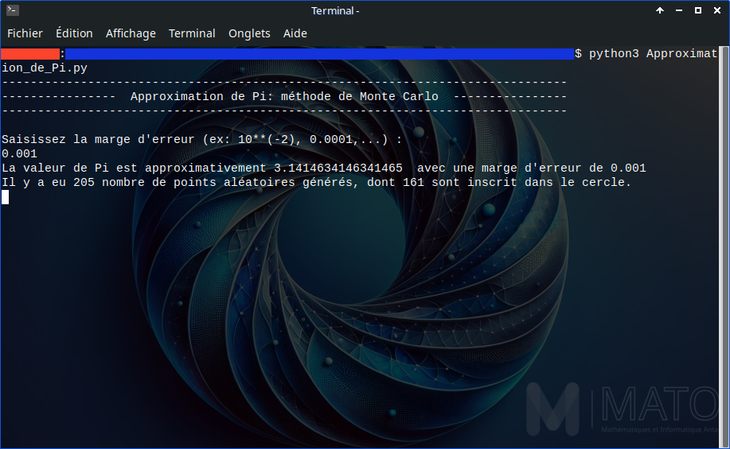
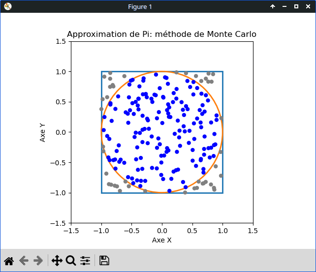
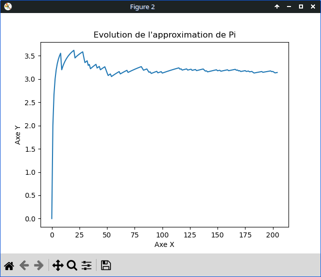

# Approximation de Pi

_Un programme qui donne une valeur rapprochée de Pi._

## Description du projet

L'objectif du programme est d'avoir une approximation de la valeur de Pi.  
Pour ce faire, on implémente la méthode de Monte Carlo en Python. 

## Méthode de Monte Carlo

Considérons un carré d'arêtes $a$ de longueur 2 (tracé dans un repère orthonormé) et le cercle inscrit dans ce carré (donc de rayon $r$ égal à 1).  
Ensuite, prenons aléatoirement plusieurs points à l'intérieur de ce carré.  
La surface du carré est $a^2 = 4$, et celle du cercle c'est $\pi r^2 = \pi$.
En faisant le rapport entre le nombre de points à l'intérieur du cercle et la totalité des points présents dans le carré, on obtient une approximation du rapport entre la surface du cercle et celle du carré, qui est $\frac{\pi}{4}$.  
En multipliant ensuite cette valeur par 4, on obtient la valeur approchée $\pi$. 

## Pré-requis

Pour avoir une visualisation des points qui se trouvent à l'intérieur et à l'extérieur du cercle, vous aurez besoin de `matplotlib`:

```bash
pip install matplotlib
```

## Lancement

Dans un terminal, lancez la commande suivante :

```python
python3 Approximation_de_Pi.py
```

## Tests

Test du programme :



Graphe des points aléatoires présents dans le carré et dans le cercle :



Graphe de l'évolution de l'approximation de Pi :



## Auteur

Hidekela, M1 MAFI 2025
